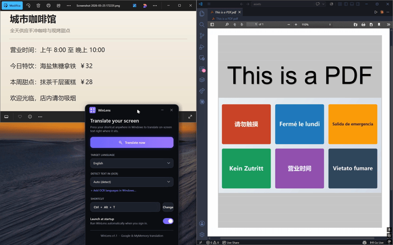
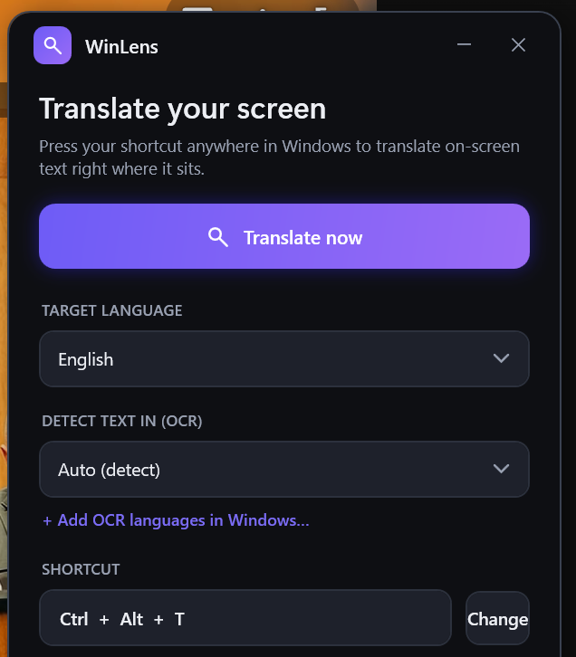

<div align="center">


# WinLens

**翻译屏幕上任何无法选中或复制的文字。**
游戏、图片、PDF、外语软件——按下快捷键，译文在原位置显示。

[English](README.md) · 简体中文

[查看使用文档 »](#使用方法)

[反馈 Bug](https://github.com/marco-beltrame/WinLens/issues/new?template=bug_report.yml) ·
[功能建议](https://github.com/marco-beltrame/WinLens/issues/new?template=feature_request.yml) ·
[讨论区](https://github.com/marco-beltrame/WinLens/discussions)

[](https://github.com/marco-beltrame/WinLens/actions/workflows/build.yml)
[](LICENSE)
[](#安装)
[](https://dotnet.microsoft.com/)
[](https://github.com/marco-beltrame/WinLens/releases)
[](https://github.com/marco-beltrame/WinLens/releases)
[](https://github.com/marco-beltrame/WinLens/stargazers)

</div>

<div align="center">

</div>

## 简介

WinLens 翻译屏幕上的文字，并将译文直接覆盖在原文之上，自动匹配背景颜色和字体，看起来就像这个应用本来就是你的语言写的一样。它基于 OCR 识别屏幕上真实渲染的像素，因此能翻译那些**无法选中、无法复制**的文字——这正是其他翻译工具做不到的。

浏览器翻译插件只能处理网页。WinLens 读取的是屏幕上真正渲染出来的内容，因此它同样适用于原生应用、游戏、聊天工具、PDF 和各种外语软件。它基于 OCR 工作，所以文字不需要可被选中。

它常驻在系统托盘，由全局快捷键触发。按下快捷键，读译文，按 <kbd>Esc</kbd> 关闭。

## 为什么用 WinLens？

浏览器扩展只能翻译*网页内部*的文字，读不到屏幕上的其他任何东西。WinLens 对屏幕实际像素跑 OCR，因此能翻译它们做不到的内容：

- **图片里的文字：** 照片、截图、表情包、信息图、扫描文档。
- **游戏：** 菜单和对话，包括各类引进/外语游戏。
- **桌面应用：** 安装程序、报错弹窗、外语软件界面。
- **PDF 和文档**，任意阅读器。
- **视频画面和字幕。**
- **任何无法选中或复制的内容。**

如果某段文字浏览器标签页已经能翻译，那你不需要 WinLens。但屏幕上其余的一切，你需要。

## 功能

- 原位翻译屏幕文字：译文替换原文，自动匹配背景与字体，而不是弹出在另一个框里。
- 适用于任意窗口（应用、游戏、聊天、文档），不限于浏览器。
- 可在同一屏幕上同时识别拉丁文字和 CJK（中文、日文、韩文）。
- 全局快捷键，默认 <kbd>Ctrl</kbd> + <kbd>Alt</kbd> + <kbd>T</kbd>。
- OCR 前先放大截图，并按文本块选用最合适的识别引擎，提升小字号文字的识别率。
- 深色控制面板。可直接在覆盖层上切换目标语言。
- 右键点击文本块即可复制原文或译文。
- 可选「开机自启」。否则它安静地待在托盘里。

## 控制面板

一个小巧的托盘应用，带深色控制面板。选择目标语言、设置快捷键、选择 OCR 源语言、开关开机自启。

<div align="center">

</div>

## 安装

### 下载

打开 [Releases](https://github.com/marco-beltrame/WinLens/releases) 页面，选择适合你 CPU 的版本
（大多数 PC 用 `win-x64`，Snapdragon / ARM 设备用 `win-arm64`）。提供两种版本：

| 下载 | 大小 | 需要运行时？ |
| --- | --- | --- |
| `WinLens-win-x64.exe` | 约 25 MB | 需要 [.NET 10 桌面运行时](https://dotnet.microsoft.com/download/dotnet/10.0) |
| `WinLens-win-x64-standalone.zip` | 约 75 MB | 不需要——已打包运行时 |

已安装（或不介意安装）.NET 10 桌面运行时就选小的 `.exe`。想免安装就选 standalone 的 `.zip`：
解压到任意位置，运行里面的 `WinLens.exe` 即可（请保持文件夹内文件在一起，`.exe` 需要同目录的 DLL）。

> GitHub 在国内下载可能较慢，如有需要可后续提供 Gitee 镜像。

该可执行文件尚未代码签名，因此首次运行时 Windows SmartScreen 可能提示「Windows 已保护你的电脑」。点击 **更多信息 > 仍要运行**。如果你想先校验下载文件，可将其 SHA256 与发布页列出的值对比：

```powershell
Get-FileHash .\WinLens-win-x64.exe -Algorithm SHA256
```

### OCR 语言包

WinLens 使用 Windows 自带的 OCR 引擎，因此只能识别已安装对应 OCR 语言包的语言。大多数系统已包含你的显示语言。添加更多（例如中文或日文）：

> 设置 > 时间和语言 > 语言和区域 >（你的语言）> 语言选项 > 可选功能 > 添加 OCR 功能。

控制面板里的「在 Windows 中添加 OCR 语言」链接会直接帮你打开该页面。新安装的语言会自动出现。

## 使用方法

1. 启动 WinLens。首次会打开控制面板，随后最小化到托盘。
2. 在控制面板里选择目标语言。
3. 在 Windows 任意位置按下快捷键（<kbd>Ctrl</kbd> + <kbd>Alt</kbd> + <kbd>T</kbd>）。
4. 屏幕被原位翻译。按 <kbd>Esc</kbd> 或关闭即可退出。

| 操作 | 方式 |
| --- | --- |
| 立即翻译 | 快捷键、托盘菜单，或控制面板按钮 |
| 打开控制面板 | 双击托盘图标，或托盘菜单 > 打开 WinLens |
| 切换目标语言 | 控制面板，或覆盖层顶栏（实时重新翻译） |
| 修改快捷键 | 控制面板 > 修改，然后按下你的组合键 |
| 选择源（OCR）语言 | 控制面板 > 识别文字语言（除非追求速度，否则保持 Auto） |
| 复制文字 | 右键点击译文块 > 复制原文 / 复制译文 |
| 开机自启 | 控制面板开关 |
| 退出 | 托盘菜单 > 退出 |

「识别文字语言」保持 Auto 通常最好：WinLens 会运行每个已安装的识别引擎，并保留各自识别得好的文字，因此混合语言的屏幕也能正常工作。指定单一语言只能省一点点时间。

## 工作原理

```
快捷键 > 捕获屏幕 > 放大 > OCR（按文字系统）> 翻译 > 原位覆盖
```

1. 捕获整个虚拟屏幕（DPI 精确，覆盖所有显示器）。
2. 将图像放大约 2 倍，让小号 UI 文字更可靠地被识别。
3. 运行每个已安装的 OCR 引擎，各自只保留文字系统匹配的文本块（拉丁文字交给拉丁引擎，CJK 交给 CJK 引擎），再去除重叠的重复项。
4. 逐行翻译（Google 接口，MyMemory 作为兜底），按会话缓存。
5. 在每行原文上绘制一个不透明、颜色与字体均匹配的覆盖框。

> 说明：OCR 在本地运行；翻译通过在线接口（Google / MyMemory）完成。离线翻译已在路线图中。

## 路线图

完整列表见 [issues](https://github.com/marco-beltrame/WinLens/issues) 和
[项目看板](https://github.com/marco-beltrame/WinLens/projects)。

- [ ] 离线翻译（Argos / NLLB）：无需联网、无速率限制、更注重隐私。
- [ ] PaddleOCR / ONNX 引擎：更强的 CJK 与小字识别，无需系统语言包。
- [ ] 跨平台（Avalonia）：macOS 和 Linux。
- [ ] 区域截取：翻译选定区域而非整个屏幕。
- [x] README 中的动画演示（GIF）。

## 从源码构建

```bash
git clone https://github.com/marco-beltrame/WinLens.git
cd WinLens
dotnet build -c Release
dotnet run
```

环境要求：Windows 10（build 19041 或更高）/ 11、[.NET 10 SDK](https://dotnet.microsoft.com/download/dotnet/10.0)，以及 Windows 桌面工作负载（WPF）。

| 参数 | 作用 |
| --- | --- |
| `--settings` | 启动时打开控制面板 |
| `--translate` | 启动时执行一次捕获并翻译 |

## 参与贡献

欢迎贡献。请阅读 [CONTRIBUTING.md](CONTRIBUTING.md) 和
[行为准则](CODE_OF_CONDUCT.md)。带
[good first issue](https://github.com/marco-beltrame/WinLens/issues?q=is%3Aissue+is%3Aopen+label%3A%22good+first+issue%22)
标签的 issue 适合作为起点。

## 许可证

MIT。见 [LICENSE](LICENSE)。

## 致谢

- 翻译通过 Google Translate 接口完成，[MyMemory](https://mymemory.translated.net/) 作为兜底。
- 托盘集成使用 [Hardcodet.NotifyIcon.Wpf](https://github.com/hardcodet/wpf-notifyicon)。
- 基于 .NET 10 与 WPF 构建。
